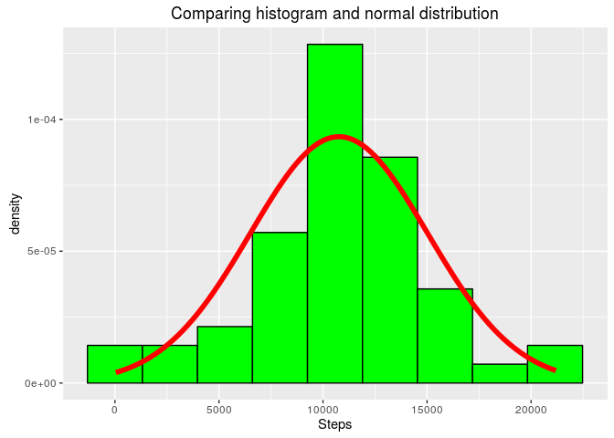

# Reproducible Research: Peer Assessment 1

Exam time again!!!


Here's a useful link to help Rmarkdown writing, by Rstudio : [R Markdown cheat sheet](https://www.rstudio.com/wp-content/uploads/2015/02/rmarkdown-cheatsheet.pdf)


# Loading libraries

```r
library(lubridate,warn.conflicts = F)
library(dplyr,warn.conflicts = F)
library(ggplot2)

#To make AWESOME tables
library(xtable)
```
# Loading and preprocessing the data


```r
if (!file.exists("activity.csv")) unzip("activity.zip")

d <- read.csv("activity.csv", stringsAsFactors = F)

# data<-data[complete.cases(data),]

data <- mutate(d, date = ymd(date))
```
# What is mean total number of steps taken per day?

Aggregating datas


```r
# dplyr version sumSteps<-d %>% group_by(date) %>% summarise( sum(steps))

# Basic version
sumSteps <- aggregate(steps ~ date, data = d, FUN = sum)

# renaming columns for convenience
colnames(sumSteps) = c("Date", "Steps")

# Computing median and mean

Mean1 <- as.integer(round(mean(sumSteps$Steps, na.rm = T), 0))
Median1 <- as.integer(round(median(sumSteps$Steps, na.rm = T), 0))
```

Now plotting time


```r
ggplot(sumSteps, aes(Steps)) + geom_histogram(bins = 9, col = "black", fill = "green") + 
    ggtitle("Histogram of Steps")
```

<!-- -->

The _mean_ total number of steps taken per day is **10766** and the _median_ is
**10765**


The choice of 9 beans instead the default of 30 bins by ggplot has been made to have kind of a 'Gaussian' look, with no empty bean.


From this graphic, we can note 
* **Data looks like normally distributed**
* Th mean and the median being very close, reinforcing this impression

## Let's go play and superpose a bell-shaped curve to the graph

We'll draw the corresponding Gaussian distribution:

- Mean= 1.0766189\times 10^{4}
- Standard deviation = 4269.1804927


```r
ggplot(sumSteps, aes(Steps))+
  geom_histogram( aes(y=..density..), bins=9,col='black', fill='green')+
  stat_function(fun=dnorm, colour='red', lwd=2, args=list(mean=mean(sumSteps$Steps), sd=sd(sumSteps$Steps)))+
  ggtitle('Comparing histogram and normal distribution')
```

<!-- -->


The graphic belows shows:

- Histogram : in green
- Density plot: in blue
- Gaussian distribution : in red


```r
ggplot(sumSteps, aes(Steps))+
  geom_histogram( aes(y=..density..), bins=30,col='black', fill='green')+
  geom_density(colour='blue', lwd=1, fill='blue', alpha=0.3)+
  stat_function(fun=dnorm, colour='red', lwd=2, args=list(mean=mean(sumSteps$Steps), sd=sd(sumSteps$Steps)))+
  ggtitle('Comparing histogram and normal distribution with 30 bins histograms')
```

<!-- -->


Comparison not so obvious.... for the histogram, as it depends on number of bins

However, we get a better feel with the density plotting (in blue)

# What is the average daily activity pattern?

First, we do aggregate data by interval

I enclosed 2 versions of the aggregation code: 

- One using the **dplyr** package, as My personal goal is to mater it, as it is more flexible and advanced than the 'base' package
- Another one using Ocam's razor **aggregate()** function


```r
# dplyr version daily<-d %>% group_by(interval) %>%
# summarise(steps=mean(steps, na.rm=T))
daily <- aggregate(steps ~ interval, data = d, FUN = function(x) {
    mean(x, na.rm = T)
})
```


Now about the plotting, the assigment required a line plot, that you can find below.
However, this plot does'nt show the missing intervals, so I built a 'barplot', with the line plot ovrlay clearly showing the data 'holes'

## Line plot of  activity pattern

```r
ggplot(daily, aes(x=interval,y=steps) ) + 
  geom_line(col='red')
```

<!-- -->

## Barplot with Line plot overlay
This one shows clearly how ggplot operates
- barplot in blue
- lineplot in red

Both using the same dataset


```r
ggplot(daily, aes(x=interval,y=steps) ) + 
  geom_bar(stat = 'identity',col='blue')+ 
  geom_line(col='red')
```

<!-- -->


The interval having the maximal mean step value being

**


```r
daily[[which.max(daily$steps),1]]
```

```
## [1] 835
```

**

# Imputing missing values

## Let's count missing values


```r
t<-table(is.na(d), dnn = 'Missing Values')

#now making it look AWESOME with xtable
print(xtable(t), type = 'html')
```

<!-- html table generated in R 3.3.0 by xtable 1.8-2 package -->
<!-- Fri May 20 02:05:31 2016 -->
<table border=1>
<tr> <th>  </th> <th> Missing Values </th>  </tr>
  <tr> <td align="right"> FALSE </td> <td align="right"> 50400 </td> </tr>
  <tr> <td align="right"> TRUE </td> <td align="right"> 2304 </td> </tr>
   </table>

So there are 2304 missing values out of 52704 (about 4.37%)

# Now filling missing values

The filling strategy is as following:
We'll replace the missing intervals for a specific day with the average of this interval


```r
#First: Build a table of means by interval
meanByIntervalAndDate <- d %>%group_by(interval,date) %>% summarize(steps=mean(steps, rm.na=T))
meanByInterval  <-aggregate(steps~interval, data=meanByIntervalAndDate, FUN=function(x) {mean(x,na.rm=TRUE)})

# Then we split data in two parts: the NA part and the non-NA part
naIndexes <-is.na(d$steps)

# We keep the NA lines and drop the 'steps' (containig only NAs) column
naPart= d[naIndexes,]
naPart$steps=NULL

#We drop the NA lines from the data
nonNaPart=d[!naIndexes,]

#Then we do a left join with the 'Mean by interval' table 
naPart<-left_join(naPart, meanByInterval, by='interval')

# We check that all lines have been filled
length(naPart[is.na(naPart$steps),'steps'])
```

```
## [1] 0
```

```r
#Then we go for row_bind betwen the naPartand the nonNaPart

d <- bind_rows(naPart, nonNaPart)
```

Now that we have a new dataframe,it is time to bilsdan histogram to check if the fact of filling data had an impact


```r
sumSteps2 <- aggregate(steps ~ date, data = d, FUN = sum)

# renaming columns for convenience
colnames(sumSteps2) = c("Date", "Steps")

# computing median and mean
Mean2 <- as.integer(round(mean(sumSteps2$Steps, na.rm = T), 0))
Median2 <- as.integer(round(median(sumSteps2$Steps, na.rm = T), 0))


ggplot(sumSteps2, aes(Steps)) + geom_histogram(bins = 9, col = "black", fill = "green") + 
    ggtitle("Histogram of Steps")
```

<!-- -->

** For this new dataset **

The _mean_ total number of steps taken per day is **10766** and the _median_ is **10766**

So we notice that the mean didn't change after having filled data.
However, the median increased by 1 unit (10765 to 10766), a **0.01% change** what is non significative


# Are there differences in activity patterns between weekdays and weekends?

This part is two fold:
1 Create a new factor variable in the dataset with two levels – “weekday” and “weekend” indicating whether a given date is a weekday or weekend day.

2 Make a panel plot containing a time series plot (i.e. type = "l") of the 5-minute interval (x-axis) and the average number of steps taken, averaged across all weekday days or weekend days (y-axis). See the README file in the GitHub repository to see an example of what this plot should look like using simulated data.

## Step one: adding the 'daytype' factor to the dataset


```r
# adding the weekday factor

#To do so, we use the wday() function what return 1 for sunday, 7for saturday, and 2..6 for the other weekday
d<-mutate(d,dayType= ifelse(wday(date) %in% c(1,7), 'weekend', 'weekday'))

#Makes it a factor, as requested
d$dayType<-as.factor(d$dayType)
```

## Step two: Creating the plot


```r
dailyByDayType <- aggregate(steps ~ interval + dayType, data = d, FUN = function(x) {
    mean(x, na.rm = T)
})

ggplot(dailyByDayType, aes(interval, steps)) + geom_area(col = "red", fill = "red") + 
    facet_grid(dayType ~ .)
```

<!-- -->

So we can see there is a difference in activity level between the weekdays and the weekends!

##Bonus track

A variant of the plot, what shows better the difference in the activity levels


```r
dailyByDayType <- aggregate(steps ~ interval + dayType, data = d, FUN = function(x) {
    mean(x, na.rm = T)
})

ggplot(dailyByDayType, aes(interval, steps, coloour = dayType, fill = dayType)) + 
    geom_area(col = "black", alpha = 0.5)
```

<!-- -->
